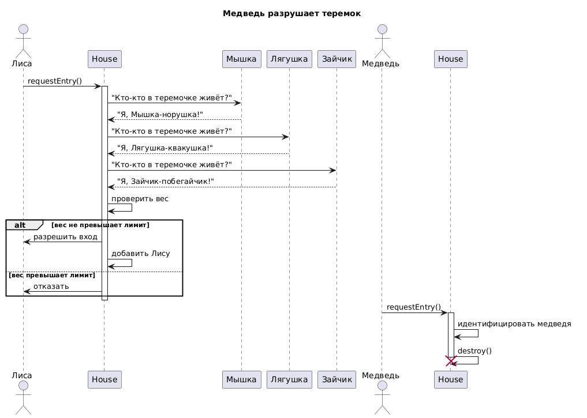

# Sequence Diagram: Система «Теремок» (Управление доступом)

## Обзор

Эта диаграмма последовательности показывает порядок обмена сообщениями между зверем (на примере Лисы), уже живущими в теремке зверями (Мышка, Лягушка, Зайчик) и самим объектом Теремок.

---

## Участники

| Участник | Тип | Роль |
|----------|-----|------|
| **Лиса** | Actor | Зверь, который хочет заселиться |
| **Теремок** | Participant | Система, обрабатывающая запрос |
| **Мышка** | Participant | Уже живёт в теремке |
| **Лягушка** | Participant | Уже живёт в теремке |
| **Зайчик** | Participant | Уже живёт в теремке |
| **Медведь** | Actor | Разрушает теремок |

---

## Описание потока сообщений

### Этап 1: Нормальный сценарий (заселение Лисы)

1. **Лиса → Теремок:** Запрос на вход
2. **Теремок → Мышка:** Опрос «Кто живёт?»
3. **Мышка → Теремок:** Ответ
4. **Теремок → Лягушка:** Опрос «Кто живёт?»
5. **Лягушка → Теремок:** Ответ
6. **Теремок → Зайчик:** Опрос «Кто живёт?»
7. **Зайчик → Теремок:** Ответ
8. **Теремок → Теремок:** Проверка веса
9. **Теремок → Лиса:** Разрешить вход

### Этап 2: Сценарий разрушения (Медведь)

1. **Медведь → Теремок:** Запрос на вход
2. **Теремок → Теремок:** Идентифицировать медведя
3. **Теремок → Теремок:** Разрушить
4. **Медведь ← Теремок:** (игнорирует проверку веса)

---
## Диаграмма

## Диаграмма последовательности

```plantuml
@startuml
!theme blueprint
title Пошаговое взаимодействие в системе "Теремок"

actor "Лиса" as Fox
actor "Медведь" as Bear
participant "Теремок" as House
participant "Мышка" as Mouse
participant "Лягушка" as Frog
participant "Зайчик" as Hare

' === Нормальный сценарий ===
Fox -> House : запроситьВход()
activate House

House -> Mouse : "Кто-кто в теремочке живёт?"
Mouse --> House : "Я, Мышка-норушка!"

House -> Frog : "Кто-кто в теремочке живёт?"
Frog --> House : "Я, Лягушка-квакушка!"

House -> Hare : "Кто-кто в теремочке живёт?"
Hare --> House : "Я, Зайчик-побегайчик!"

House -> House : проверить вес
alt вес не превышает лимит (totalWeight + вес_лисы <= 100)
    House -> Fox : разрешить вход
    House -> House : добавить Лису в жильцы
else вес превышает лимит
    House -> Fox : отказать
end
deactivate House

' === Сценарий разрушения ===
Bear -> House : запроситьВход()
activate House
House -> House : идентифицировать медведя
House -> Bear : (игнорирует проверку веса)
House -> House : разрушить()
destroy House
deactivate House

note right of House
  Медведь разрушает теремок,
  все жильцы покидают его.
end note
@enduml
