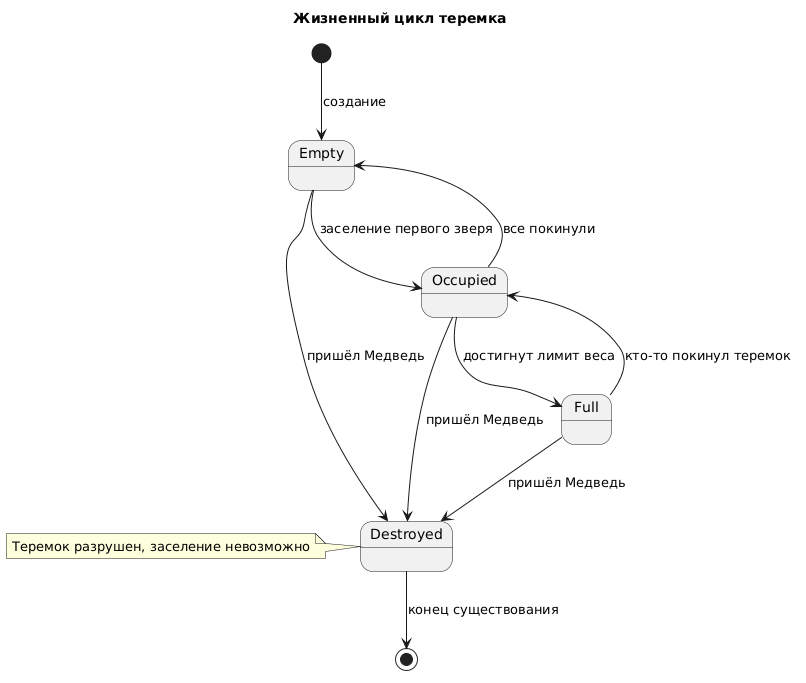

# State Diagram: Система «Теремок» (Управление доступом)

## Обзор

Эта диаграмма состояний показывает жизненный цикл теремка. Состояния меняются в зависимости от заселения зверей, достижения лимита веса и прихода Медведя.

---

## Состояния

| Состояние | Описание |
|-----------|----------|
| **Empty** | Пустой теремок (нет жильцов) |
| **Occupied** | Заселён (есть хотя бы один жилец, но лимит не достигнут) |
| **Full** | Полностью заполнен (достигнут лимит веса = 100) |
| **Destroyed** | Разрушен (Медведь игнорирует проверку и ломает теремок) |

---

## Переходы

| Откуда | Куда | Событие / Условие |
|--------|------|-------------------|
| [*] | Empty | Создание теремка |
| Empty | Occupied | Заселение первого зверя |
| Occupied | Full | Достигнут лимит веса (totalWeight = 100) |
| Full | Occupied | Кто-то покинул теремок (вес стал < 100) |
| Occupied | Empty | Все жильцы покинули теремок |
| Empty | Destroyed | Пришёл Медведь |
| Occupied | Destroyed | Пришёл Медведь |
| Full | Destroyed | Пришёл Медведь |
| Destroyed | [*] | Конец существования (теремок разрушен) |

---
## Диаграмма

## Диаграмма состояний

```plantuml
@startuml
!theme blueprint
skinparam state {
  BackgroundColor<<Destroyed>> #pink
}

title Жизненный цикл теремка

[*] --> Empty : <<create>>

state Empty
state Occupied
state Full
state Destroyed <<Destroyed>>
state c <<choice>>

' Начальное состояние
Empty --> Occupied : заселение первого зверя

' Нормальные переходы
Occupied --> Full : достигнут лимит веса (totalWeight = 100)
Full --> Occupied : кто-то покинул теремок
Occupied --> Empty : все покинули

' Переходы с проверкой (альтернатива)
Empty --> c : пришёл Медведь
Occupied --> c : пришёл Медведь
Full --> c : пришёл Медведь

c --> Destroyed : [Медведь игнорирует вес]
Destroyed --> [*] : <<destroy>>

note left of c
  **Точка выбора (Choice)**
  Медведь игнорирует
  проверку веса и
  разрушает теремок.
end note

note right of Destroyed
  Теремок разрушен,
  дальнейшее заселение
  невозможно.
end note
@enduml
